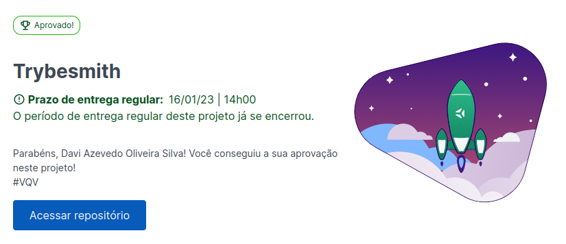

# Trybesmith

  

### Sobre

Trybesmith é um projeto feito durante o módulo de back-end do curso da Trybe. O objetivo era desenvolver um CRUD de itens medievais, no formato de uma API, utilizando Typescript.

O código foi dividido nas camadas model, service e controller, além de possuir middlewares e rotas. Tudo isso pode ser encontrado na pasta `src`

### Como rodar o projeto

<details>
  <summary><strong>🐳 Rodando no Docker vs Localmente</strong></summary><br />

## Com Docker

> Rode os serviços `node` e `db` com o comando `docker-compose up -d`.

- Lembre-se de parar o `mysql` se estiver usando localmente na porta padrão (`3306`), ou adapte, caso queria fazer uso da aplicação em containers
- Esses serviços irão inicializar um container chamado `trybesmith` e outro chamado `trybesmith_db`.
- A partir daqui você pode rodar o container `trybesmith` via CLI ou abri-lo no VS Code.

> Use o comando `docker exec -it trybesmith bash`.

- Ele te dará acesso ao terminal interativo do container criado pelo compose, que está rodando em segundo plano.

> Instale as dependências [**Caso existam**] com `npm install`

⚠ Atenção ⚠ Caso opte por utilizar o Docker, **TODOS** os comandos disponíveis no `package.json` (npm start, npm test, npm run dev, ...) devem ser executados **DENTRO** do container, ou seja, no terminal que aparece após a execução do comando `docker exec` citado acima.

⚠ Atenção ⚠ O **git** dentro do container não vem configurado com suas credenciais. Faça os commits fora do container, ou configure as suas credenciais do git dentro do container.

## Sem Docker

> Instale as dependências [**Caso existam**] com `npm install`

⚠ Atenção ⚠ Não rode o comando npm audit fix! Ele atualiza várias dependências do projeto, e essa atualização gera conflitos com o avaliador.

✨ **Dica:** Para rodar o projeto desta forma, obrigatoriamente você deve ter o `node` instalado em seu computador.
✨ **Dica:** O avaliador espera que a versão do `node` utilizada seja a 16.

</details>

<details>
  <summary><strong>🎲 Diagrama Entidade Relacionamento do projeto</strong></summary><br />
  O banco de dados do projeto segue a estrutura abaixo:

  

</details>

<details>
  <summary><strong>🏦 Conexão com o Banco</strong></summary><br />

**⚠️ É essencial configurar essas 3 variáveis de ambiente para testar o projeto localmente:**

```
  host: process.env.MYSQL_HOST
  user: process.env.MYSQL_USER
  password: process.env.MYSQL_PASSWORD
```

**⚠️ Existe um arquivo já criado chamado .env.example onde estão listadas as variáveis de ambiente esperadas no projeto.**

</details>
